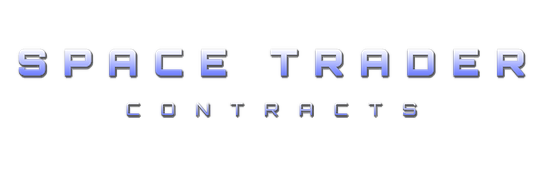

  

  

## Description

Space Trader - Contracts is a space trading game for the browser, heavily inspired by the classic PALM OS game *Space Trader* by Pieter Spronck. It is a single-page web application written in vanilla JavaScript, HTML and CSS. It works on desktop and mobile, and saves your progress in the browser.

You start with a small ship, 1000 credits and a trader's dream. In a procedurally generated galaxy of 800 star systems you can: buy and sell goods where prices are best, plan routes from star to star, upgrade your ship at the shipyard (from the humble Flea up to the Wasp and the police cruiser), equip it with gadgets, weapons, shields and special systems, and take on contracts: manhunts for wanted ships, police hero missions, passenger rides and cargo deliveries.

Travel between systems is not safe: pirates attack, police patrol, traders cross your path — and every encounter can be resolved with combat, surrender, bribery or negotiation. The game is managed through a full economy layer: trading, bank, loans and repayment, police record, reputation, bounties, fines, and even prison if your record goes too low.

## Documentation

| Document | Description |
|---|---|
| [00-index](docs/00-index.md) | Index and overview of the documentation |
| [01-getting-started](docs/01-getting-started.md) | How to start playing, controls and first steps |
| [02-the-galaxy](docs/02-the-galaxy.md) | Procedurally generated star systems and galaxy map |
| [03-market-and-trading](docs/03-market-and-trading.md) | Goods, prices, buying and selling |
| [04-bank-and-finance](docs/04-bank-and-finance.md) | Bank, loans and repayments |
| [05-ships-and-equipment](docs/05-ships-and-equipment.md) | Shipyard, ship types, gadgets, weapons and shields |
| [06-traveling](docs/06-traveling.md) | Routes, travel and warp between systems |
| [07-encounters-and-combat](docs/07-encounters-and-combat.md) | Pirates, police, traders and combat resolution |
| [08-missions-and-contracts](docs/08-missions-and-contracts.md) | Contracts, manhunts and hero missions |
| [09-reputation-police-prison](docs/09-reputation-police-prison.md) | Reputation, police record, fines and prison |
| [10-survival-strategy-score](docs/10-survival-strategy-score.md) | Survival tips and scoring |
| [11-options-and-saving](docs/11-options-and-saving.md) | Options menu and save system |

> **Note:** This documentation has been generated by AI.

## License

Project contents are licensed under the [GNU Affero General Public License v3](./LICENSE).

### Third-party assets

| Asset | License |
|-------|---------|
| Orbitron font (`fonts/`) | [SIL Open Font License 1.1](https://scripts.sil.org/OFL) |
| bg.ogg (`sfx/`) | [CC0 1.0](https://creativecommons.org/publicdomain/zero/1.0/) |
| warp.ogg (`sfx/`) | [CC0 1.0](https://creativecommons.org/publicdomain/zero/1.0/) |
| boom.ogg (`sfx/`) | [CC BY 3.0](https://creativecommons.org/licenses/by/3.0/) |
| ng.ogg (`sfx/`) | [CC BY 3.0](https://creativecommons.org/licenses/by/3.0/) |
| tension.ogg (`sfx/`) | [CC BY 3.0](https://creativecommons.org/licenses/by/3.0/) |
| travel.ogg (`sfx/`) | [CC BY 4.0](https://creativecommons.org/licenses/by/4.0/) |
| wormhole.ogg (`sfx/`) | [CC BY 4.0](https://creativecommons.org/licenses/by/4.0/) |